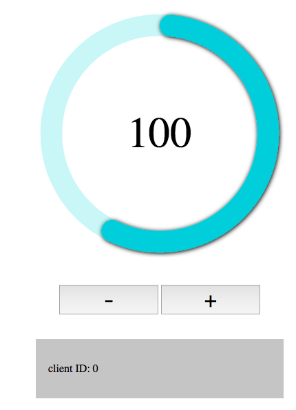
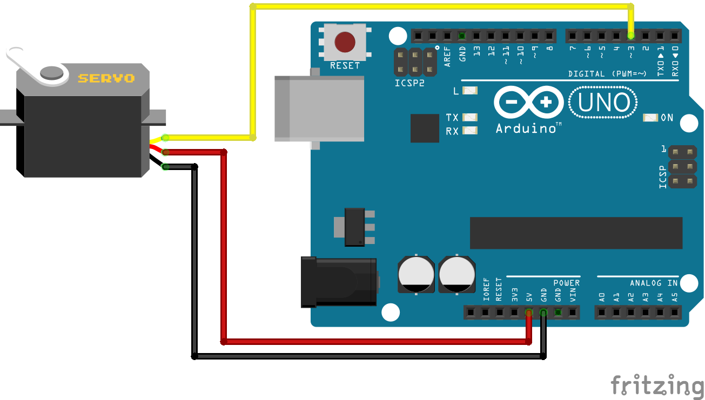

firmata servo
===

> A demonstration of how to use firmata / johnny five to control a servo via web UI

This example controls a servo attached to an arduino board via firmata. Users can interface with the arduino via a web interface that uses [express](https://expressjs.com) and [socket.io](https://github.com/socketio/socket.io).

There is one solution that uses the [johnny-five library](http://johnny-five.io/) which makes working with firmata a little easier. The second example uses [firmata.js](https://github.com/firmata/firmata.js/) to communicate with the arduino.

# Setup

To use the code you will need an arduino with FirmataPlus flashed on it as well as a servo motor connected to PIN3 (see below)

# Usage

* install dependencies
* attach arduino via USB port
* change the USB port where your arduino is located (arduino studio can help you to find it) in `firmata.js`
* run either `node firmata` or `node johnny5` depending on which version you want to test
* open http://localhost:3000 in your browser
* for fun open it in multiple browsers

# firmata.js vs johnny-five

When comparing johnny-five and firmata.js you need to remember that johnny-five is more or less an extension of the firmata.js module. Where firmata.js brings you a javascript implementation of the firmata protocol, johnny-five also brings classes for the most common hardware modules attached to your arduino, so you don't have to worry about the initialization routines of firmata and your hardware.

The main differences when using firmata.js instead of johnny-five are:

|  issue  |  firmata.js  | johnny-five |
| ------- | ----------- | ---------- |
| connecting to a board | firmata.js requires explicit port specification when using `new Board(port)` | johnny-five allows for auto-discovery of boards (huge benefit for beginners) |
| working with hardware | lets you read/write [digital pins](https://github.com/firmata/firmata.js/#pin) and brings a function for [servo control](https://github.com/firmata/firmata.js/#servo) as well as [I2C](https://github.com/firmata/firmata.js/#i2c) | huge set of [apis](http://johnny-five.io/api/) to work with many different devices |
| interactive console | not available | brings you a REPL console |
