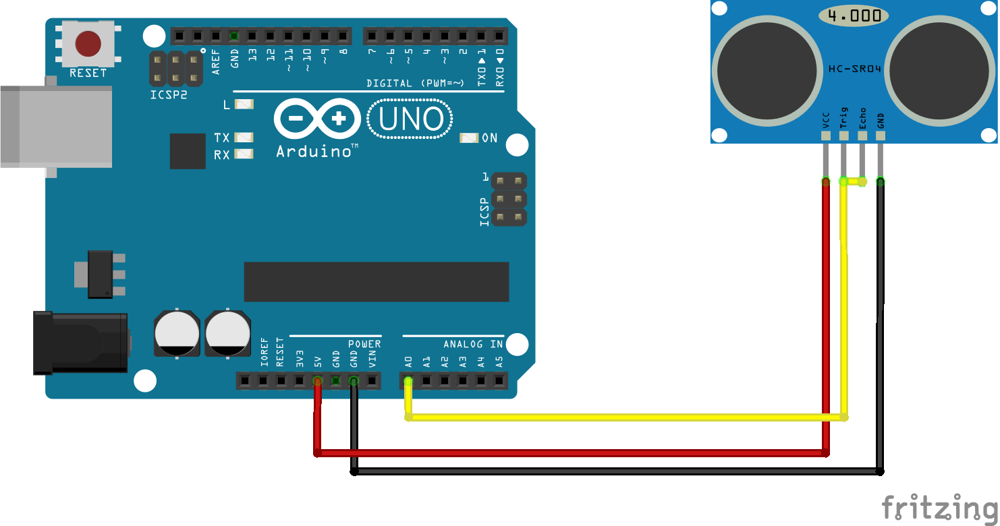

firmata sonar
===

> A demonstration of how to use johnny-five and chartist.js to visualize sonar readings

# Setup

To use the code you will need an arduino with [PingFirmata](https://gist.githubusercontent.com/rwaldron/0519fcd5c48bfe43b827/raw/f17fb09b92ed04722953823d9416649ff380c35b/PingFirmata.ino) flashed on it as well as a HC-SR04 sonar sensor connected to A0 (see below)

# Usage

* install dependencies
* attach arduino via USB port
* run `node index`
* open website
* move object within 1m range of sonar sensor
