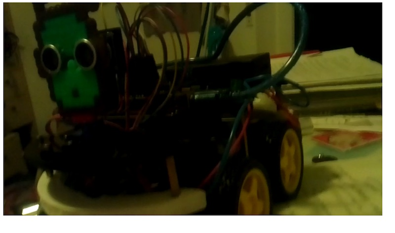

# raspi-cam-stream

> quicktest webcams running the feed through a website

## usage

Well.. hook up the raspi3 with a camera module, run this code on the raspberry and open [http://raspberrypi:3030](http://raspberrypi:3030) to see your video.

## screenshot

## credits

This code is heavily inspired by [131/h264-live-player](https://github.com/131/h264-live-player)
