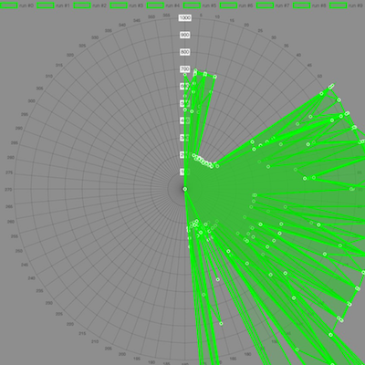
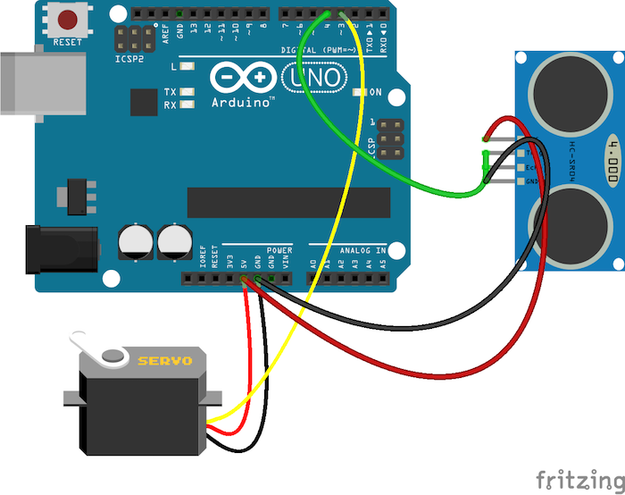
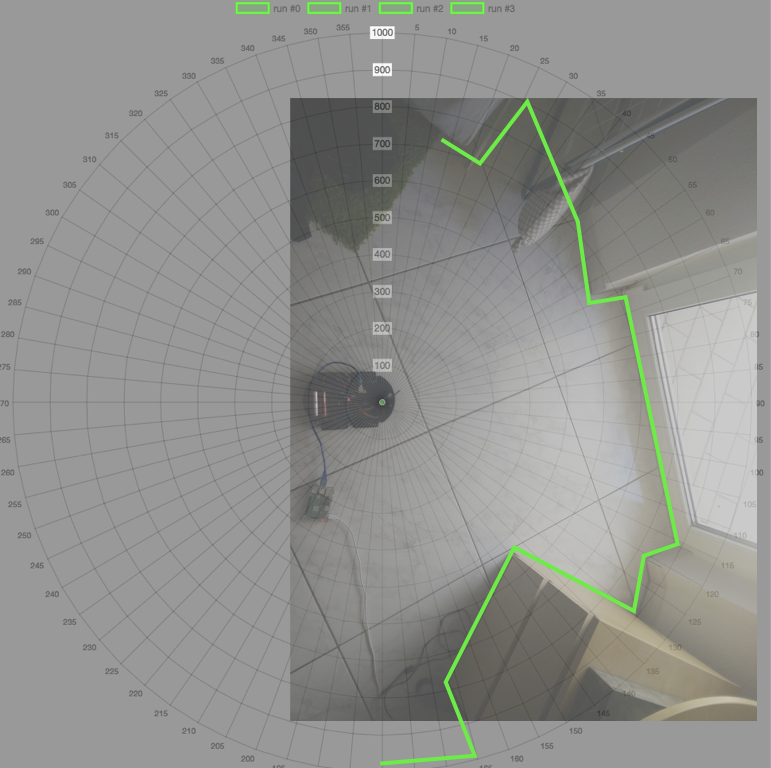
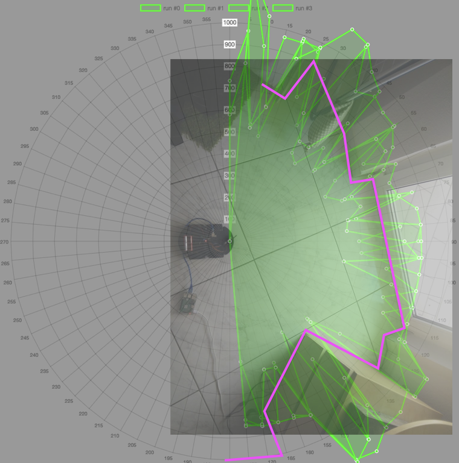

firmata-sonar-map
===

> create a sonar map 📡🗾 using a HCSR-04 sensors



# explanation

The app runs a node process that moves the servo in 5° steps, executes multiple sonar readings at the position and draws the measured distance on a radar chart.

## usage

To setup you need to install the main project directory as well as `./web` directory

```sh
cd projects/firmata-sonar-map
npm install
cd web
npm install
```

You can start the app incl the web server with `node index`

# setup

Requires a HCSR-04 sensor and a standard servo hooked to a arduino uno running PingFirmata firmware
* HCSR-04 connected on PIN3
* servo connected on (PWM) PIN4



# sensor evaluation

## close distance

Trying to detect a room within close distance (~50-100cm), made the following findings:
* walls/obstacles with more or less perpendicular surface are detected
* readings are not consistent

This is what the room the sonar tried to map looks like:


After 4 complete sweeps this picture came out (magenta being the expected values):

