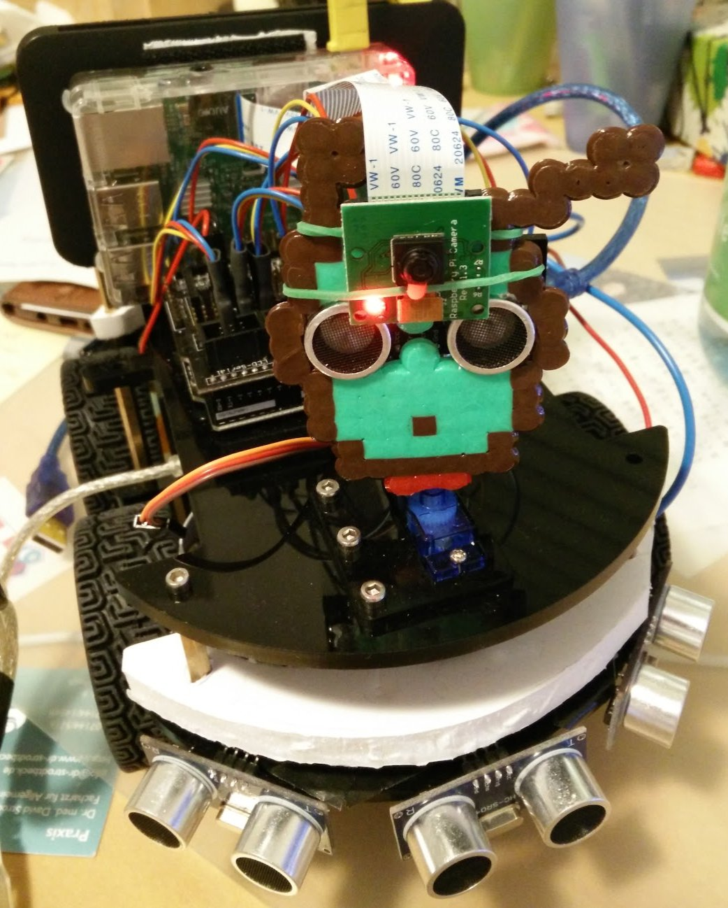
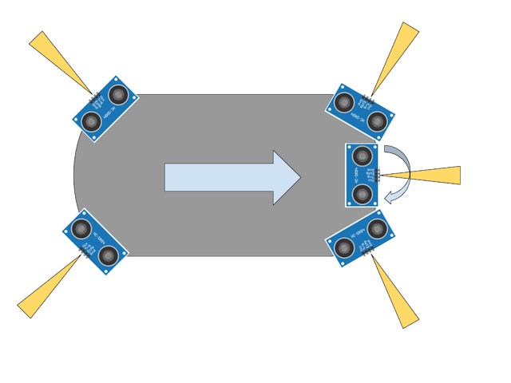
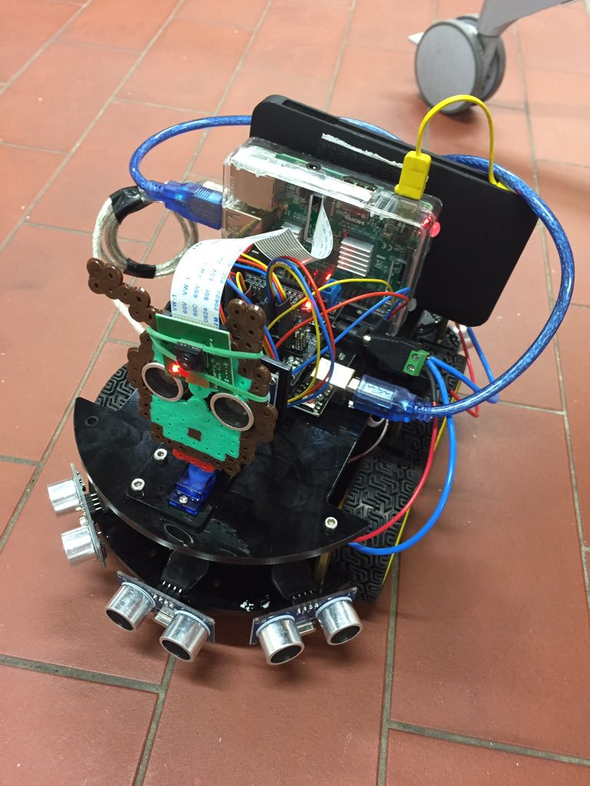
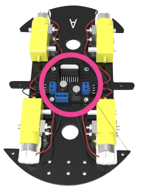
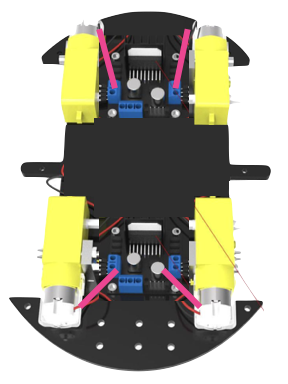

# robby5

> robot car ecosystem 🤖🚗

The idea behind `robby-five` is to build different components in a robotic/autonomous (toy) car ecosystem.

Inspired by [johnny-five](http://johnny-five.io/) the main controlling unit will run on higher level languages like nodeJS or python. The underlying hardware components will be controlled by arduino hardware.

The base setup is the [elegoo smart robot car kit v2](https://www.elegoo.com/product/elegoo-uno-project-upgraded-smart-robot-car-kit-v2-0/). However the components on it only allow to build really basic robots. To make it usable for some higher level automation it needs the base needs to be extended with additional sensors for environment perception as well as ego motion sensors.



> The most advanced build is the [multibot](projects/multi-bot) setup

<!-- TOC depthFrom:2 -->

- [examples](#examples)
- [chassis evolution](#chassis-evolution)
  - [multiple sonar sensors](#multiple-sonar-sensors)
  - [autonomous nodebot](#autonomous-nodebot)
  - [4WD](#4wd)
  - [optimize movement](#optimize-movement)
  - [relative robot localization](#relative-robot-localization)
  - [remote localization](#remote-localization)
  - [map generation](#map-generation)
- [troubleshooting](#troubleshooting)
  - [serialport does not install on raspbian](#serialport-does-not-install-on-raspbian)
  - [node module installation fails using `yarn`](#node-module-installation-fails-using-yarn)
- [future ideas](#future-ideas)

<!-- /TOC -->


## examples

There is a list of examples on how to use the underlying components within this project

| example | description |
|--|--|
|[firmata-servo](./examples/firmata-servo) | Shows how to use [johnny-five](http://johnny-five.io/) or [firmata.js](https://github.com/firmata/firmata.js/) to control a servo. |
| [j5-chartist-sonar](./examples/j5-chartist-sonar) | Capture HC-SR04 sonar distance readings via johnny-five and chart them on a website. |
| [raspi-led](./examples/raspi-led) | Use raspberry pi IO to play with LEDs using johnny-five / raspi-io |
| [raspi-sonar-servo](./examples/raspi-sonar-servo) | raspberry as control server for two attached arduinos |

## chassis evolution

a list of ideas how the standard set of the robot can be improved to become a bit smarter.

### multiple sonar sensors

`Status`: ✅




Hook the car up with at least 5 sonar sensors to allow better areal awareness.
The idea is to interface the sensors via an additional arduino that exposes the individual sensors over I2C.

### autonomous nodebot

`Status`: ✅

re-implement the default smart robot car program using raspi & nodeJS as control device. Use sonar for obstacle detection:
* move straight until obstacle <20cm distance
* move sonar to right/left using the servo
* turn robot in the direction with most distance to next obstacle
* repeat

### 4WD

`Status`: ✅

> This has been implemented in [projects/firmata-sonar-map](./projects/firmata-sonar-map/4wd_test.js)
wheels on each side are controlled in pairs, using individual wheel control might improve maneuverability e.g. only stopping rear wheel to turn


| before | after |
|:---:|:---:|
|the original setup comes with one motor driver that allows two seperately controlled outputs. this is set up to drive the wheel pair on either side in sync. | adding an additional motor driver allows to drive each wheel individually. this requires 2 additional pins on the µc to be used. |
| |  |

### optimize movement

`Status`: 🚧 (_4WD was a first step_)

some issues with the base robot car should be improved when it comes to movement:

1. DC engines do not allow for proper odometry due to varying speed, maybe use **steppers**
1. ~~wheels have high grip which makes it hard to turn. having lower friction (especially lateral) would allow easier turns.~~ turns out that turning is only hard for low wheel speeds, increasing to proper speeds lets the robot turn just fine 👯
1. although quite expensive (100€ per set) the [**mecanum wheels**](https://www.youtube.com/watch?v=8sH1a511_q4) would allow amazing 2D movements in any direction incl strafing.
control logic would be a bit trick probably as well as possible negative influences on odometry solutions
- evaluate using 2 driven wheels in front and one undriven wheel in the rear for stability. this would be a cheap solution for the masses. unsure what negative side effects this would have as opposed to 4 wheels.

### relative robot localization

`Status:` 💡

use odometry, inertial sensors, sonar/lidar feedback to allow for a control loop system aware of its past movement.

### remote localization

`Status:` 💡

Set up a stationary camera that tracks the robot. Locate it on the map and send use this information to make the robot move within the map.

### map generation

`Status:` 💡

come up with an idea how to use the sonar sensor (possibly rotating) to map a room by driving through it.

> first implementation of a radar chart with rotating 180° servo is available in the [firmata-sonar-map](./projects/firmata-sonar-map) project

## troubleshooting

### serialport does not install on raspbian

for some reason jessy doesn't ship with git installed which the `serialport` module needs during its make.

```sh
apt-get install git
```

### node module installation fails using `yarn`

yes it happens.. guess it's something with the compilation use `npm install` instead

## future ideas

- **robby wars**:
attach laser diodes & laser sensor to the robot. build a remote control web UI to maneuver the robot. attach LED strips to indicate health bars (or on the web UI). use your laser beam to hit other robots